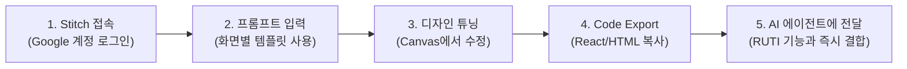

# 🎨 Google Stitch를 활용한 RUTI UI/UX 디자인 개선 가이드
**How to Accelerate RUTI Design Iterations with Google Stitch**

---

## 1. Google Stitch 개요

**Google Stitch ([stitch.withgoogle.com](https://stitch.withgoogle.com/))**는 Google Labs에서 개발한 AI-Native UI 디자인 도구입니다. 자연어 프롬프트나 스케치를 입력하면 고품질의 모바일 앱 화면 레이아웃을 생성하고, 이를 **HTML / CSS / React 코드 및 Figma 파일**로 즉시 내보낼 수 있습니다.

---

## 2. Stitch ➔ RUTI 반영 워크플로우 (Step-by-Step)



### Step 1. Stitch 접속 및 시작
1. 브라우저에서 **[stitch.withgoogle.com](https://stitch.withgoogle.com/)** 접속.
2. Google 계정으로 로그인 (무료 크레딧 제공).
3. **[Create New Project]** 또는 프롬프트 입력창 선택.

### Step 2. 화면별 최적화 프롬프트 복사 & 실행
아래 3장의 화면별 추천 프롬프트 중 필요한 것을 복사하여 Stitch에 입력합니다.

---

## 3. RUTI 맞춤형 화면별 Stitch 프롬프트 템플릿

### 📱 화면 1: 메인 홈 (클린 애슬레틱 다이어리 & 스토리 캘린더)
```text
A modern, premium mobile workout journal and deco app named "RUTI" with a Clean Athletic aesthetic (inspired by Nike Training & Apple Fitness).
- Dark matte charcoal background (#0b0f17) with electric titanium orange (#ff5e36) and cyan accents.
- Top: Minimal brand header with "14 Days Streak" flame badge.
- Weekly horizontal story chips and expandable monthly stamp calendar.
- Main Canvas: Sleek workout log card with bench press sets (weights, reps, empty bar badge), total volume pill badge (3,450 kg), and draggable athletic badges, photo polaroids, and sticky notes.
- Bottom navigation bar with 4 clean icons (Journal, Timer, Body Gallery, Stats).
- High-contrast typography, sharp modern cards, ultra-clean mobile layout.
```

### 🏋️ 화면 2: 운동 기록 바텀시트 (Set & Exercise Builder)
```text
A sleek mobile bottom sheet modal for logging workout sets in a clean athletic fitness app.
- Muscle group selection tabs (Chest, Back, Legs, Shoulders) with favorite star icons.
- Exercise selection list with search bar.
- Input controls for Weight (kg) and Reps with a one-touch "Empty Bar (빈봉)" toggle button.
- Clean list of accumulated sets (Set 1: 40kg x 12, Set 2: 60kg x 10, Set 3: 70kg x 6 PR).
- Big bold CTA button: "Complete Workout Log".
```

### 🎨 화면 3: 다꾸 소품 팔레트 & 이모티콘 마켓 드로어 (Deco Drawer)
```text
A trendy mobile slide-out drawer palette for workout diary decoration items.
- Dark semi-transparent blur glassmorphism background.
- Categorized tabs: [Creator Emoticons, Text Stamps, Masking Tapes, Sticky Notes, Photos].
- Grid layout showing cute character fitness stickers (collab with indie emoji creators), bold workout PR stamps, and pastel washi tapes.
- Clean preview and one-tap insert into the canvas.
```

### 📸 화면 4: 인스타 스토리 공유 캡처 모달 (Instagram Story Export)
```text
A retro-modern 9:16 vertical Instagram Story export preview modal for a fitness app.
- Dark aesthetic gym background with subtle blur.
- Centered stylish summary card displaying: Date, Routine name, Total Volume (3,450kg), PR badges, and workout selfie photo.
- Clean branding badge "#Made_with_RUTI" at the bottom.
- Action buttons: "Save to Gallery" and "Direct Share to Instagram Stories".
```

---

## 4. 결과물을 RUTI 프로젝트에 이식하는 방법

Stitch에서 마음에 드는 디자인이 완성되면 아래 방법 중 하나로 AI 에이전트에게 전달해 주세요:

1. **방법 A (가장 추천 - Code Export)**:
   * Stitch 우측 상단의 **[Export Code]** (또는 `React / HTML`) 버튼을 눌러 생성된 코드를 복사합니다.
   * 채팅창에 코드를 그대로 붙여넣고 `"이 코드를 메인 홈 컴포넌트에 반영해줘"`라고 요청합니다.
   * ➔ AI가 기존의 IndexedDB 로컬 저장소, 다꾸 터치 제스처 로직과 결합하여 실제 동작하는 컴포넌트로 변환합니다.

2. **방법 B (Figma 또는 스크린샷)**:
   * 디자인 화면을 캡처하거나 Figma 링크를 전달해 주시면, 해당 레이아웃과 CSS 토큰을 정확히 추출하여 반영합니다.

---

## 5. Stitch 프롬프트 작성 꿀팁 (Best Practices)

* **컬러 코드 명시**: 원하는 메인 컬러(예: `Matte Charcoal #0b0f17`, `Electric Orange #ff5e36`)를 프롬프트에 직접 적으면 톤앤매너가 정확해집니다.
* **디자인 레퍼런스 언급**: `Inspired by Nike Training App, Apple Fitness, Strava`와 같이 유명 앱 이름을 곁들이면 완성도가 비약적으로 상승합니다.
* **UI 구조 구체화**: 헤더, 캘린더, 카드, 바텀 네비게이션 등 원하는 컴포넌트를 위에서 아래 순서로 나열해 주세요.
